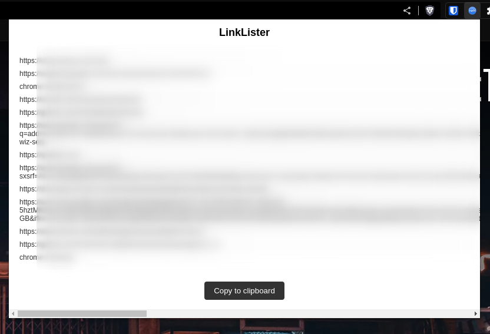

# LinkLister

Collects all the links open in the browser and displays them in a dialog box.



## Usage
1. Clone the repository - 
    ```bash
    git clone https://github.com/0xCardinal/LinkLister.git --depth 1
    ```
2. Open your Chrome browser and go to the Extensions page - `chrome://extensions`
3. Make sure the Developer Mode is enabled.
4. Click the Load upacked button.
5. Select and upload the clone folder.

